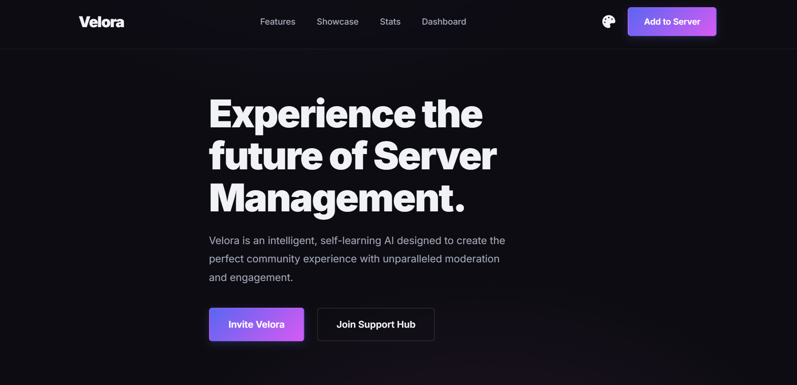

# ✨ Velora Bot Landing Page

#### A **professional, multi-theme landing page** for your Discord bot featuring **Dark, Light, Cyberpunk, Lofi, and Synthwave** themes. Crafted with style, responsiveness, and clarity by **Wanestial Development**.
---

## 🌟 Live Preview

  

---

## 🚀 Features

- **5 Unique Themes:** Dark, Light, Cyberpunk, Lofi, Synthwave  
- **Smooth Theme Switching:** Instantly change themes without page reload  
- **Responsive Design:** Perfect on desktop, tablet, and mobile  
- **Clean Layout:** Showcase bot features, commands, and invite links  
- **Easy Customization:** Update text, buttons, colors, and images  
- **Lightweight & Fast:** Minimal dependencies for smooth performance  

---

## 🎨 Theme Showcase

| Theme        | Description                                   |
|--------------|-----------------------------------------------|
| Dark Mode    | Sleek, modern, and professional               |
| Light Mode   | Clean, soft, and readable                     |
| Cyberpunk    | Futuristic neon glow                          |
| Lofi         | Cozy pastel vibes                             |
| Synthwave    | Retro gradients and vibrant visuals           |

---

## 📦 Usage Instructions

This repository is a **template-enabled project**:  

1. Click **Use this template** to create your own copy.  
2. **Forking is disabled** to ensure all copies use the template method.  
3. Open `index.html` in your browser OR host online:  
   - **Vercel:** Drag & drop repo → Deploy instantly  
   - **GitHub Pages:** Push repository → Enable Pages  
   - **Netlify:** Connect repository → Auto deployment  

4. Customize your bot:  
- Change **name, description, invite link, and features**  
- Add screenshots/GIFs in `/assets` folder  
- Modify themes with CSS or Tailwind classes  

---

## 💻 Support

- Contact **Wanestial Development**: **[wanestialofficial@gmail.com]**  
- Join our **support community** (if available)  
- Guidance available for **setup, deployment, and theme customization**

---

## ⚠️ Important Notes

- **No Redistribution:** Do not share, sell, or publicly redistribute this code  
- **Credit Required:** Always retain **Wanestial Development** attribution  
- Use for **personal or internal projects only**

---

## 📜 License

See [LICENSE](LICENSE) for full terms.  
© 2025 **Wanestial Development**

---
